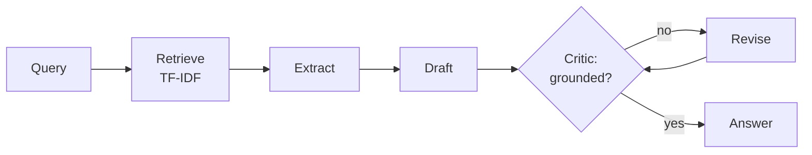

<div align="center">



[](https://www.linkedin.com/in/arnav-soni-7a706b2b4)
[](mailto:soniarnav19@gmail.com)

</div>

<p align="center"></p>

```python
arnav = {
    "role":       "AI/ML Developer",
    "university": "GGSIPU — B.Tech CSE '23–'27",
    "focus":      ["RAG", "LLM fine-tuning", "Agents", "Backend for AI"],
    "stack":      ["Python", "FastAPI", "PyTorch", "HuggingFace", "LangChain"],
}
```

<p align="center"></p>

<table>
<tr>
<td width="33%" valign="top">

**AI Developer Intern**
Desible.ai · Jul – Aug 2026

BERT intent classifier in a production voice-agent pipeline — routes generic intents to fixed responses, **cutting LLM calls**. Designed a **50-label taxonomy** across 4 domains; built an LLM labeling pipeline for Hindi/English code-switched transcripts → **~397K-row** training set.

</td>
<td width="33%" valign="top">

**AI Intern**
HCLTech (EPES AI Innovation) · Jan – Apr 2026

GenAI pipeline extracting & structuring data from **PDF contracts**. Benchmarked SARIMAX, Exp. Smoothing and Linear Regression on MAPE over 3–11 years — SARIMAX won at scale.

</td>
<td width="33%" valign="top">

**AI Developer Intern**
Jobeyze Limited, Canada · Jun – Aug 2025

AI immigration chatbot + top-3 job matching from a resume. Scrapy pipelines **re-crawl every 6 hours** and diff into a live PostgreSQL knowledge base. Async FastAPI + Celery + Redis, Dockerized.

</td>
</tr>
</table>

<p align="center"></p>

| Project | Stack | Result |
|---|---|---|
| **[BERT LoRA Fine-Tuning](https://github.com/Arnav-77/REPO)** | PyTorch · HuggingFace · LoRA from scratch · CI | ~95% of full fine-tuning accuracy (87.9% vs 92.7%) at 1.1% trainable params, ~38% less GPU memory. Warmup + early stopping took r=8 from 45% → 84%. |
| **[Stateful Research Agent](https://github.com/Arnav-77/REPO)** | Python · TF-IDF retrieval · rule-based grounding | 5-step retrieve → extract → draft → critique → revise loop, with an HTML trace viewer (latency, tokens, critic verdicts, diffs). |

<p align="center"></p>

<details>
<summary><b>🔍 How setup beat rank in my LoRA sweep</b></summary>

<br>

At r=8, LoRA stalled at **45%** accuracy. Adding LR warmup + early stopping — with no change to rank — pushed it to **84%**. Takeaway: fix the training setup before tuning rank.

</details>

<details>
<summary><b>🧠 Research agent architecture</b></summary>

<br>



</details>

<p align="center"></p>

<div align="center">

### Languages


### ML / NLP


### LLM APIs


### Backend & Infra


### Data & Vector Stores


</div>

---

<div align="center">

<picture>
  <source media="(prefers-color-scheme: dark)" srcset="https://raw.githubusercontent.com/Arnav-77/Arnav-77/output/github-snake-neon.svg" />
  
</picture>




</div>
